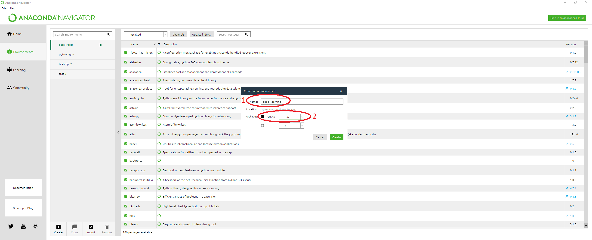

# SBGF environment preparation instructions
This is an installation guide for the environment used on the SBGF Machine Learning and Deep Learning Tutorial.

# CUDA and CUDNN

If you have a gpu-enabled (nvidia) computer that supports cuda 10.0 the first step is to install it alongside with cudnn >= 7.4.1. If you don't, skip to the environment creation step.

Guides that will help you with cuda installation:

[https://www.tensorflow.org/install/gpu](https://www.tensorflow.org/install/gpu)
[https://docs.nvidia.com/cuda/index.html](https://docs.nvidia.com/cuda/index.html)
[https://docs.nvidia.com/deeplearning/sdk/cudnn-install/index.html](https://docs.nvidia.com/deeplearning/sdk/cudnn-install/index.html)

# Environment creation with Anaconda

1. Download Anaconda for your operational system [https://www.anaconda.com/distribution/](https://www.anaconda.com/distribution/) and follow it's installation guide [https://docs.anaconda.com/anaconda/install/](https://docs.anaconda.com/anaconda/install/)
2. Download the requirements.txt that is available on this repository.
    If you have a nvidia gpu and already installed cuda and cudnn, download the requirements.txt available on ./gpu/requirements.txt
    If you don't have a nvidia gpu, download the requirements.txt available on ./cpu/requirements.txt

Now there are two options to create the environment: one via terminal and the another using the Anaconda Navigator.

Via terminal:
1. Open the terminal on the folder with the requirements.txt file and execute
  ```sh
  conda create -n deep_learning python=3.6
  ```
2. After the creation, activate the environment and install the necessary dependencies with
  ```sh
  conda activate deep_learning
  pip install -r requirements.txt
  ```
  
Via Anaconda Navigator:
1. Open the anaconda navigator by clicking on it's icon or via terminal with
  ```sh
  anaconda-navigator
  ```
2. On the environment's tab (#1), click the create button (#2) to create a new environment.

3. Fill the name (#1) and packages (#2) fields and click the create button, this may take a few minutes.

4. Once created, you have to activate the environment, to do it, select the environment by clicking over it's name and on the play symbol. This will open an options window, select open terminal.

5. On terminal, navigate to the folder where the requirements.txt file is located and execute
  ```sh
  pip install -r requirements.txt
  ```
  


